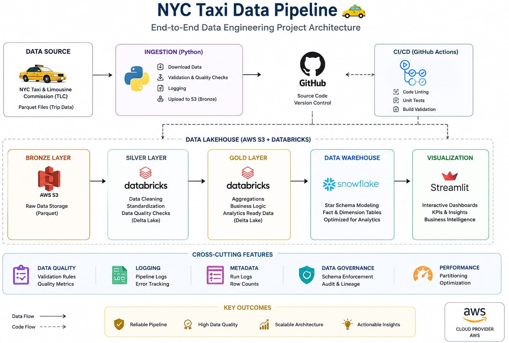

# NYC Taxi Data Engineering Pipeline

## Overview

This project demonstrates an end-to-end Data Engineering pipeline built using AWS S3, PySpark, Snowflake, and Streamlit.
The pipeline ingests NYC Yellow Taxi trip data, processes it through a Medallion Architecture (Bronze → Silver → Gold), loads analytical datasets into Snowflake, and provides business insights through an interactive dashboard.

**Dataset Size:** 37M+ taxi trip records [NYC TLC data 2023](https://www.nyc.gov/site/tlc/about/tlc-trip-record-data.page)
---

## Architecture

## Tech Stack
* Python
* PySpark
* AWS S3
* Snowflake
* Streamlit
* Git & GitHub
* VS Code

---

## Data Pipeline
### Bronze Layer

* Download raw NYC Taxi trip data
* Store source files in AWS S3
* Preserve original data for auditing and reprocessing

### Silver Layer

* Data type standardization
* Null handling
* Invalid record filtering
* Data quality checks
* Feature enrichment

### Gold Layer

* Daily Location Summary
* Hourly Demand Analysis
* Payment Type Analysis
* Monthly KPI Summary
---

## Snowflake Data Warehouse
The Gold layer data is loaded into Snowflake and modeled using Fact and Dimension tables.

### Dimensions
* Dim Date
* Dim Location
* Dim Payment Type

### Fact
* Fact Daily Trip
---

## Dashboard Features
* Revenue Analysis
* Trip Demand Trends
* Location Performance
* Payment Type Analysis
* Monthly KPI Overview
---

## Project Highlights
* Processed 37M+ taxi trip records
* Implemented Medallion Architecture
* Built scalable PySpark ETL pipelines
* Integrated AWS S3 and Snowflake
* Developed analytics-ready data models
* Created interactive Streamlit dashboards
---

## Future Enhancements
* Apache Airflow Orchestration
* Real-time Data Processing
* CI/CD Pipeline
* Data Quality Monitoring
---

## Author
**Dibya Ranjan Bisoyi**
Data Engineering Portfolio Project
